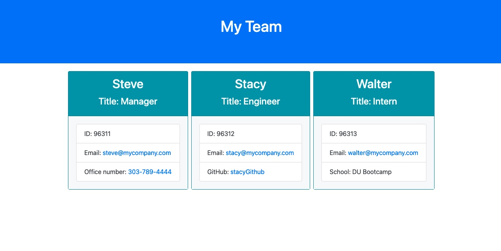

# Team_Profile_Generator

## Description

This application takes a managers's input to create a webpage that displays the team's basic info so they may quickly access their emails and Github profiles.
This application also has been tested to verify basic team input will be retrived

## Video Demonstraction

Here is a link to the visual demonstration showing the tests passing, user prmpts, and the final webpage

https://drive.google.com/file/d/1ZjBKol8DdhRd87F1DCxF4j0dR9ox7F3-/view

Here is a link to the final HTML page that was created from the video example: https://github.com/michlimones/Team_Profile_Generator/blob/main/dist/index.html

## Visual Example

Here is a screenshot of the final webpage

Here is a link to the final HTML page that was created from the video example: https://github.com/michlimones/Team_Profile_Generator/blob/main/dist/index.html
